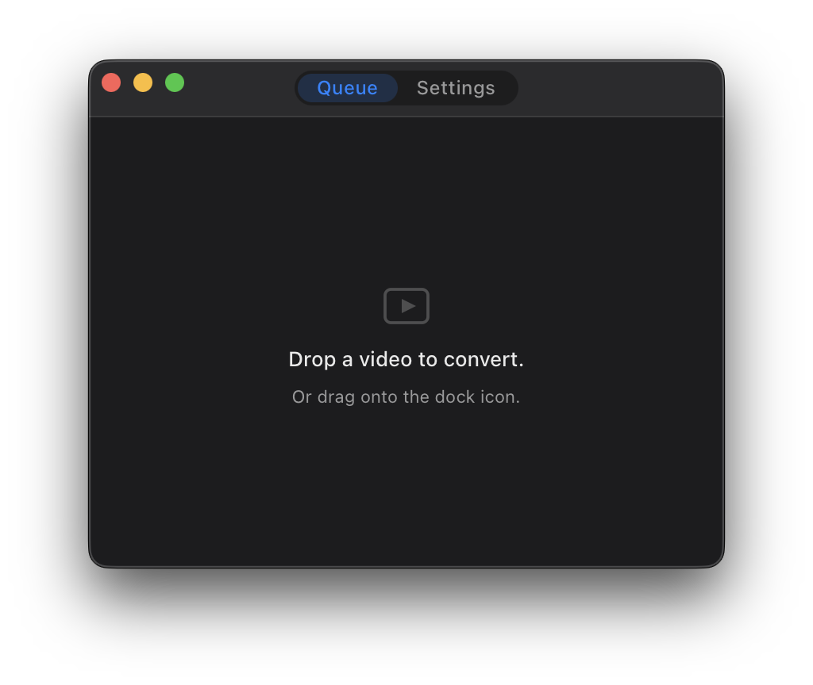
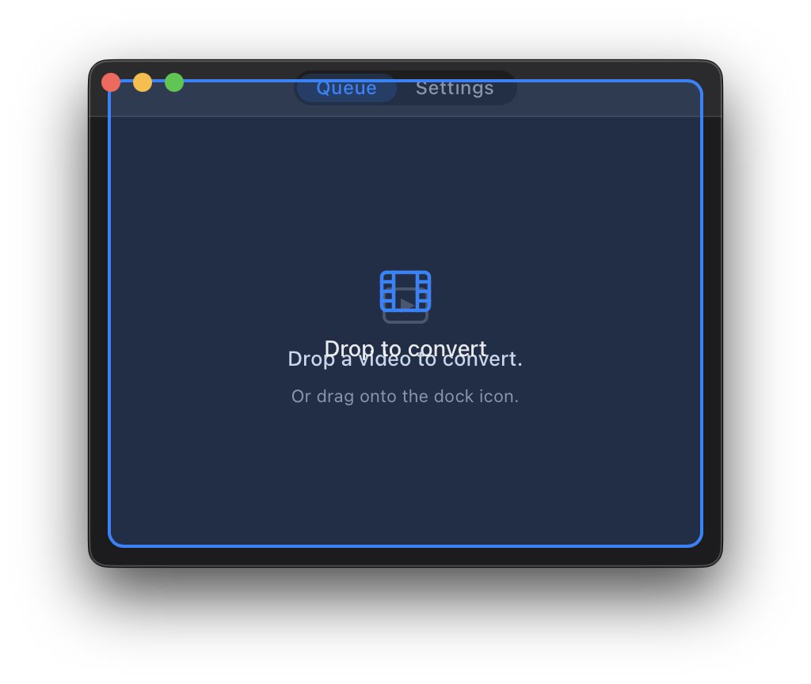
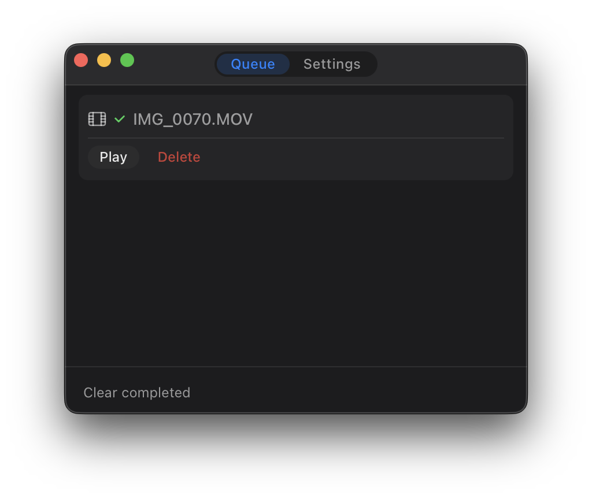

# Trasmuto

Drop a video. Get an MP4.

  

## Download

[Latest release](https://github.com/matija/trasmuto/releases/latest)

## First launch

macOS blocks unsigned apps. Run this after moving the app to `/Applications`:

```sh
xattr -d com.apple.quarantine /Applications/Trasmuto.app
```

## Releasing

Bump the version in `src-tauri/tauri.conf.json` and `src-tauri/Cargo.toml`, then push a semver tag:

```sh
git tag v1.2.0 && git push origin v1.2.0
```

The release workflow builds a `.dmg` and publishes it to GitHub Releases.
